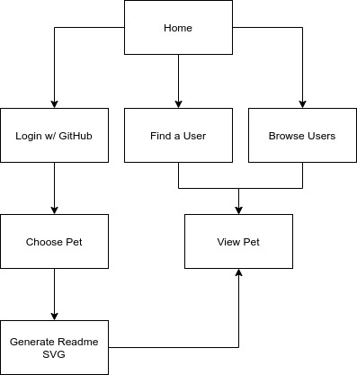
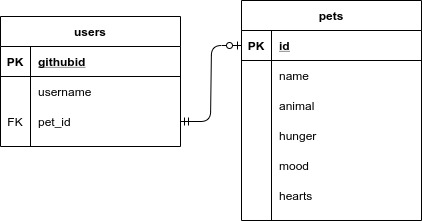

# GitPets Project Proposal

## TODO

---

First step in OAuth web flow  
[https://github.com/login/oauth/authorize?client_id=2fe2c3035596868c0000](https://github.com/login/oauth/authorize?client_id=2fe2c3035596868c0000)


To serve SVG files for github readme  
[https://stackoverflow.com/questions/13808020/include-an-svg-hosted-on-github-in-markdown
](https://stackoverflow.com/questions/13808020/include-an-svg-hosted-on-github-in-markdown
)

for OAuth  
[https://docs.github.com/en/developers/apps/authorizing-oauth-apps#2-users-are-redirected-back-to-your-site-by-github](https://docs.github.com/en/developers/apps/authorizing-oauth-apps#2-users-are-redirected-back-to-your-site-by-github)

example. query

```javascript
    query { 
  viewer { 
    contributionsCollection(from:"2020-05-05T00:00:00Z", to:"2020-05-05T00:00:00Z") {
      contributionCalendar{
        totalContributions
      }
    }
  }
}
```

Use react router to set content-type in headers to svg-xml

### Unit testing components

- data fetch component
- pet render component

## Goal

This project aims to be a habit building productivity app that uses the GitHub
API to measure commit frequency. Users who sign up can pick a pet to take care
of, and they take care of the pet by making commits and using different
languages. A user can display an SVG on their GitHub profile which reflects
their pet's current state.

## Outline

**Frontend**: Vanilla JavaScript, but this may potentially change.

**Backend**: Node, Express, Axios

**Testing**: Jest and Supertest.

**APIs**:

- [GitHub API](https://docs.github.com/en/free-pro-team@latest/rest)
- [OAuth Octokit Client](https://github.com/octokit/auth-oauth-app.js)
- [Octokit API Client](https://octokit.github.io/rest.js/v18)

**Login**: GitHub OAuth.

## Data needs

Only the last 7 days of data is requested each time.

### Data Accessed

- contributionsCollection: _A contributions collection aggregates contributions
such as opened issues and commits created by a user._
  - totalCommitContributions: _To measure frequency of public contributions._
  - restrictedContributionsCount: _To measure frequency of public contributions._
  - commitContributionsByRepository: _This aggregates commits made by a user
  within one repository._
    - LanguageConnection: _To measure the variety of languages used in recent contributions._

## Pet Care

- Frequent contributions will keep your pet from getting hungry.
- Contributions that vary in type and language will keep your pet from getting bored.
- Making sure your pet gets lots of hearts keeps them from getting sad.

Each pet species has different needs. Some species are harder or easier to take
care of than others.

## Rendered SVG parts

- Pet's name (Max characters: 15)
- Species body
- Species mood faces
  - Happy
  - Bored
  - Hungry
  - Sad
- Stat bars (Range 1-160)

## User Flow



## Database Schema


